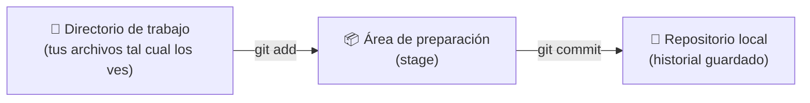
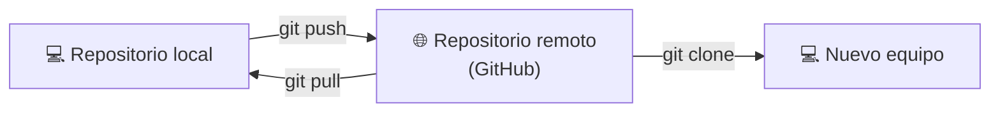
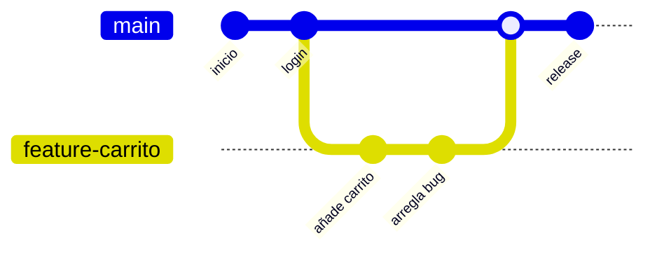
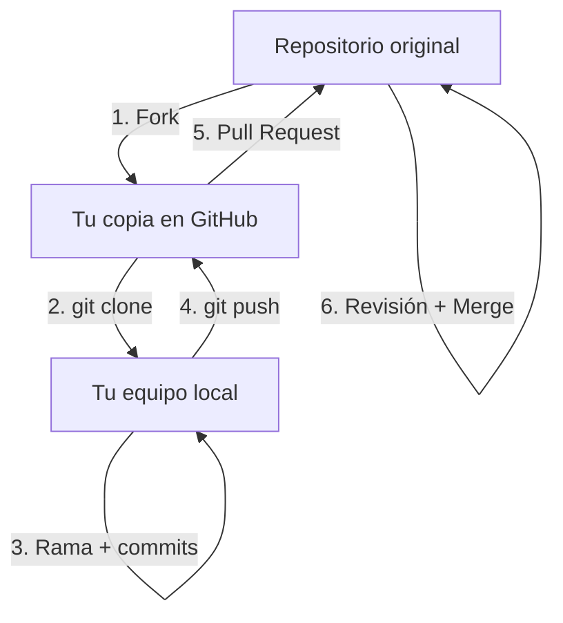

# UD1. Control de versiones: Git y GitHub

!!! tip "¿Por qué lo primero?"
    Vais a usar Git y GitHub **desde hoy hasta el último día de curso**, en todas las prácticas. Cuanto antes se os haga costumbre, menos código perderéis por accidente 🙂

---

## 1. Un vistazo rápido

| | ¿Qué es? |
|---|---|
| 🗂️ **Git** | Un programa que instalas en tu ordenador. Guarda el **historial de versiones** de tus archivos. Funciona sin conexión a internet. |
| 🌐 **GitHub** | Una web que aloja repositorios Git **en la nube**. Permite compartir código, colaborar y hacer copia de seguridad remota. |

> Git es la herramienta. GitHub es uno de los sitios donde puedes guardar tus repositorios de Git (hay otros: GitLab, Bitbucket...).

---

## 2. Instalación y configuración

### Instalar Git

* Descarga: [git-scm.com/download](https://git-scm.com/download)
* Comprueba que se ha instalado bien:

```bash
git --version
```

### Configurar tu identidad (una sola vez por ordenador)

```bash
git config --global user.name "Nombre Apellidos"
git config --global user.email "tu_correo@edu.gva.es"
```

!!! warning "No lo olvides"
    Cada `commit` que hagas queda firmado con este nombre y correo. Si no configuras esto, luego no podrás verificar la autoría de tus prácticas.

### (Opcional) Elegir editor de texto para Git

Si no indicas nada, Git usará `vim`, que es incómodo si no lo conoces. Mejor usa VS Code:

```bash
git config --global core.editor "code --wait"
```

---

## 3. El ciclo de vida de un archivo en Git

Esta es **la idea más importante** de toda la unidad. Un archivo pasa por tres "sitios" antes de quedar guardado de verdad:



* **Directorio de trabajo:** donde editas tus archivos normalmente.
* **Área de preparación (*stage*):** una "cesta" donde vas metiendo los cambios que quieres guardar en la próxima versión.
* **Repositorio:** el historial real, con todas las versiones (commits) ya confirmadas.

!!! note "Truco para entenderlo"
    Piensa en el `commit` como hacer una **foto** del contenido de la cesta (área de preparación) en ese instante. Lo que no metiste en la cesta, no sale en la foto.

---

## 4. Comandos básicos en local

### Crear un repositorio

```bash
git init
```
Lo ejecutas **una vez**, dentro de la carpeta de tu proyecto.

### Ver en qué estado están tus archivos

```bash
git status
```

| Color | Significado |
|---|---|
| 🔴 Rojo | Archivo modificado o nuevo, **todavía no está en la cesta** |
| 🟢 Verde | Archivo ya añadido al área de preparación, **listo para el próximo commit** |

### Ver qué ha cambiado exactamente

```bash
git diff              # cambios sin preparar
git diff --staged     # cambios ya en la cesta
```

### Añadir cambios a la cesta

```bash
git add archivo.txt   # un archivo concreto
git add .             # todos los archivos nuevos o modificados
```

### Confirmar cambios (crear una versión)

```bash
git commit -m "Mensaje claro de lo que has hecho"
```

!!! tip "Buenos mensajes de commit"
    ❌ `"cambios"`, `"cosas"`, `"asdf"`
    ✅ `"Añade validación del formulario de login"`

### Ver el historial

```bash
git log            # historial completo
git log --graph    # historial en forma de árbol
```
Se navega con las flechas ↑ ↓ y se sale pulsando `q`.

### Deshacer cosas (con cuidado)

| Comando | Qué hace | ¿Peligroso? |
|---|---|---|
| `git reset archivo` | Saca un archivo de la cesta (no pierdes el cambio) | 🟢 Seguro |
| `git checkout -- archivo` | Descarta los cambios del archivo, vuelve al último commit | 🔴 **Peligroso, se pierde el cambio** |
| `git stash` | Guarda los cambios a un lado temporalmente | 🟢 Seguro |
| `git stash pop` | Recupera lo guardado con `stash` | 🟢 Seguro |

### Ignorar archivos: `.gitignore`

Crea un archivo llamado `.gitignore` en la raíz del proyecto con los archivos/carpetas que **no** quieres subir (ficheros compilados, carpetas de configuración del IDE, contraseñas...):

```
*.class
/bin/
.vscode/
```

Hay plantillas ya hechas para casi cualquier lenguaje en [github.com/github/gitignore](https://github.com/github/gitignore).

---

## 5. Pasar a lo remoto: GitHub

Hasta ahora todo ha sido en tu ordenador. Para compartirlo o hacer copia de seguridad, lo subimos a GitHub:



| Comando | Qué hace |
|---|---|
| `git clone URL` | Descarga un repositorio remoto completo a tu ordenador |
| `git push` | Sube tus commits locales a GitHub |
| `git pull` | Descarga y fusiona los cambios que hay en GitHub |
| `git remote -v` | Muestra a qué repositorio remoto estás conectado |

---

## 6. Ramas (*branches*)

Una rama es una **línea de trabajo independiente**. Te permite probar cosas o desarrollar una funcionalidad sin tocar el código que ya funciona.



| Comando | Qué hace |
|---|---|
| `git branch` | Lista las ramas que tienes |
| `git branch nombre-rama` | Crea una rama nueva |
| `git checkout nombre-rama` | Cambia a esa rama |
| `git checkout -b nombre-rama` | Crea la rama **y** cambia a ella en un solo paso |
| `git merge nombre-rama` | Fusiona esa rama con la actual |

!!! note "Conflictos de fusión"
    Si dos ramas modifican **la misma línea** del mismo archivo de forma distinta, Git no sabe cuál te interesa y te pide que decidas tú. Esto es un **conflicto**: no es un error, es Git pidiéndote ayuda.

---

## 7. Trabajo colaborativo en GitHub: Fork + Pull Request

Este es el flujo habitual cuando colaboras en un proyecto que no es tuyo (o en las prácticas en grupo):



1. **Fork:** te copias el repositorio a tu cuenta de GitHub.
2. **Clone:** te lo bajas a tu ordenador.
3. Trabajas en una **rama**, haciendo tus commits.
4. **Push:** subes la rama a tu copia (*fork*) en GitHub.
5. **Pull Request (PR):** le pides al proyecto original que incorpore tus cambios.
6. El dueño del proyecto revisa tu código (*code review*) y, si está bien, lo fusiona (*merge*).

---

## 8. Buenas prácticas 💡

* Haz **commits pequeños y frecuentes**, no un único commit gigante al final del día.
* Escribe mensajes de commit **en presente e imperativo**: "Añade", "Corrige", "Elimina"...
* Una **rama por funcionalidad o por bug**, no trabajes siempre directamente sobre `main`.
* Añade un `.gitignore` **desde el primer commit** del proyecto.
* Antes de empezar a trabajar cada día, haz `git pull` para tener la última versión.
* Nunca subas contraseñas, claves de API ni datos personales a un repositorio.

---

## 9. Chuleta resumen

| Quiero... | Comando |
|---|---|
| Crear un repositorio | `git init` |
| Ver el estado de mis archivos | `git status` |
| Ver qué he cambiado | `git diff` |
| Preparar cambios para guardarlos | `git add archivo` / `git add .` |
| Guardar una versión | `git commit -m "mensaje"` |
| Ver el historial | `git log --graph` |
| Crear y cambiar de rama | `git checkout -b nombre-rama` |
| Fusionar una rama | `git merge nombre-rama` |
| Clonar un repositorio remoto | `git clone URL` |
| Subir cambios a GitHub | `git push` |
| Bajar cambios de GitHub | `git pull` |

---

## 10. Para saber más

* [Libro de Git en español](https://git-scm.com/book/es/v2/) — la referencia completa y gratuita.
* [Hoja de referencia oficial de GitHub (PDF)](https://training.github.com/downloads/es_ES/github-git-cheat-sheet.pdf)
* [github.com/github/gitignore](https://github.com/github/gitignore) — plantillas de `.gitignore` por lenguaje.
* Curso "Gestión de la tarea docente con GitHub" (Pedro Prieto, CEFIRE): [github.com/pedroprieto/curso-github](https://github.com/pedroprieto/curso-github)
