# UD2. Introducción a la programación

## Índice

- Lenguajes de programación
    - Clasificación
    - Evolución
    - Estructura
- Código fuente
- Proceso de compilación
- Máquina Virtual
- Entorno de desarrollo

---

## Hardware

- Un ordenador, la máquina en sí misma, la parte física que se puede tocar, es lo que se denomina **hardware**.
- La propia caja que contiene los componentes electrónicos, el teclado, la pantalla, el ratón, la impresora... todos esos elementos son el hardware.
- En el módulo de *Sistemas Informáticos* se profundiza con más detalle en estos elementos.

## Software

- Conjunto de programas, datos y documentación que forman una aplicación.
- **Tipos:**
    - **Aplicación:** ofrece un servicio al usuario (procesador de texto, navegador web, etc.).
    - **Sistema:** gestiona el ordenador (sistema operativo, compiladores, etc.).

## Uso del hardware para el software

- **Memoria:** almacena los datos e instrucciones.
- **CPU:** ejecuta las instrucciones almacenadas en la memoria.
- **Periféricos E/S:** permiten al usuario introducir datos a tener en cuenta en la ejecución de los programas y visualizar los resultados.
- **Buses:** canales de comunicación entre el resto de componentes.

## Algoritmo

Conjunto ordenado y finito de operaciones que permite hallar la solución de un problema.

Se ejecuta por un ordenador, siendo realizadas multitud de operaciones sencillas, divididas en:

- Operaciones aritméticas (sumar, restar, multiplicar y dividir)
- Operaciones lógicas (operaciones "and", "or", "not" y "xor")
- Comparaciones (si algo es mayor/menor/igual a otra cosa)
- Mover información (entrada/salida de datos, almacenar datos)

## Lenguaje de programación

- Conjunto de instrucciones, operadores y reglas de sintaxis y semántica.
- Permiten al programador comunicarse con los dispositivos de *hardware* y *software* existentes.

Sin un lenguaje de programación, un ordenador solo entiende cadenas de ceros y unos (código máquina), algo inviable de manejar directamente para programas de cierto tamaño.

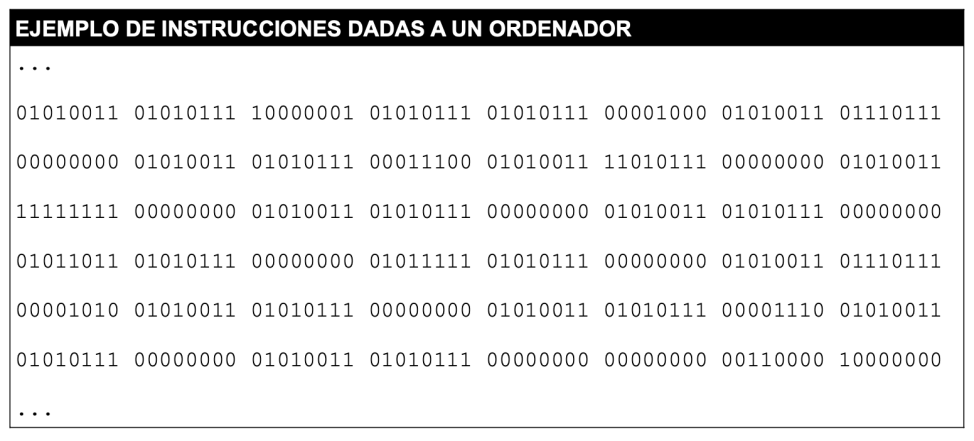

---

## Lenguajes de programación: tipos

Los lenguajes de programación se pueden clasificar según dos criterios:

- **Nivel de abstracción:** bajo nivel, nivel medio, alto nivel, 4GL, lenguas naturales.
- **Forma de ejecución:** compilado, interpretado, intermedio.

| Nivel de abstracción | Forma de ejecución |
|---|---|
| 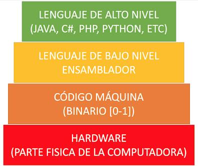 | 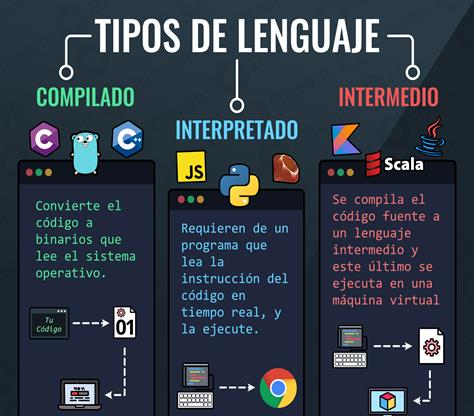 |

### Según nivel de abstracción

**Lenguaje de bajo nivel (1ª generación)**

- Código máquina (cadenas interminables de 1's y 0's) y ensamblador.
- El programador tiene control total del ordenador. Dependen de cada fabricante de hardware.
- Es difícil hacer programas con estos lenguajes a partir de cierto tamaño.
- A cambio, se obtiene el máximo rendimiento y velocidad.

**Lenguajes de nivel medio (2ª generación)**

- Lenguajes donde ya disponemos de cierto nivel de abstracción, pero los programadores tienen que tener en cuenta ciertas particularidades, como el manejo, la reserva y la liberación de ciertos recursos hardware (memoria, ficheros, etc.).

**Lenguajes de alto nivel (3ª generación)**

- La gran mayoría de los lenguajes de programación que se utilizan hoy en día pertenecen a este nivel de abstracción.
- En su mayoría, los lenguajes del paradigma imperativo y el de programación orientada a objetos.
- Permiten una forma de programar mucho más entendible e intuitiva.
- Buscan la aproximación al lenguaje humano, donde algunas instrucciones parecen ser una traducción directa de nuestro propio lenguaje.

**Lenguajes 4GL (4ª generación)**

- Son lenguajes creados con un propósito específico, que permiten reducir la cantidad de líneas de código.
- Por ejemplo, SQL.

**Lenguas naturales (5ª generación)**

- Pretenden abstraer más aún el lenguaje utilizando un lenguaje natural con una base de conocimientos que produce un sistema basado en el conocimiento.
- Principalmente basados en Inteligencia Artificial.


### Según forma de ejecución

- **Compilado:** convierte el código a binario que lee el sistema operativo (ej.: C, C++, Go).
- **Interpretado:** requiere un programa que lea la instrucción del código en tiempo real y la ejecute (ej.: JavaScript, Python, Ruby).
- **Intermedio:** se compila el código fuente a un lenguaje intermedio, y este último se ejecuta en una máquina virtual (ej.: Java, Kotlin, Scala).

---

## Lenguajes compilados

### Proceso general

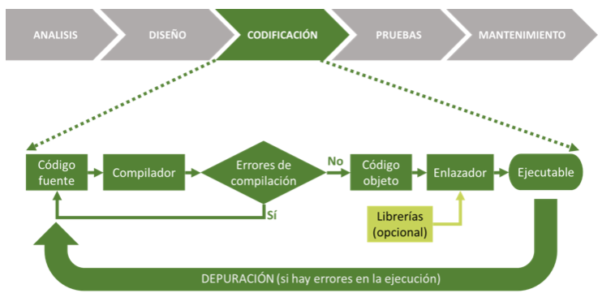

1. Se escribe el **código fuente**.
2. El **compilador** lo traduce y comprueba si hay errores de compilación.
3. Si no hay errores, se genera el **código objeto**.
4. El **enlazador** une el código objeto con las **librerías** (opcional) y genera el **ejecutable**.
5. Si en la ejecución aparecen errores, se depura el código fuente y se repite el proceso.

### Código fuente

- Programa escrito en un lenguaje de alto nivel (texto ordinario que contiene las sentencias del programa en un lenguaje de programación).
- Necesita ser traducido a código máquina para poder ser ejecutado.
- Normalmente se escribe en un IDE (Entorno Integrado de Desarrollo, como por ejemplo PyCharm o NetBeans) y se almacena en ficheros de texto.

### Compilador

- Programa encargado de traducir los programas fuente escritos en un lenguaje de alto nivel a lenguaje máquina y de comprobar que las llamadas a las funciones de librería se realizan correctamente.
- Esta traducción se hace de forma completa: todo el código fuente se analiza y se comprueba antes de generar el código objeto. Si se detecta cualquier error, no se genera ningún código.

### Código objeto

- Es el programa fuente traducido (por el compilador) a código máquina.
- Aún no es directamente ejecutable, ya que no contiene todos los elementos externos al programa que este necesita para terminar de funcionar.

### Bibliotecas (librerías)

- Colección de programas ya hechos (ya sea por nosotros o por terceros), que ya están traducidos a código máquina, listos para utilizar en un programa y que facilitan la labor del programador.
- Un ejemplo de librerías son las funciones que se añaden al propio lenguaje para hacer tareas comunes a muchos programas (ej.: imprimir por pantalla, funciones matemáticas, uso de periféricos, acceso a Internet, etc.).

### Enlazador

- Es el programa encargado de insertar en nuestro código objeto el código máquina de las funciones de las librerías de las que hayamos hecho uso, y de hacer el montaje que producirá un programa ejecutable en código máquina.
- En los compiladores modernos, el proceso de compilación y enlazado se produce simultáneamente, por lo que no siempre es evidente esta separación.

### Ejecutable

- Traducción completa a código máquina, realizada por el enlazador, del programa fuente, y que ya es directamente ejecutable.
- Por ejemplo, cuando nos instalamos una nueva aplicación en el móvil, esto es lo que nos descargamos desde la tienda correspondiente.

---

## Lenguajes interpretados

### Proceso general

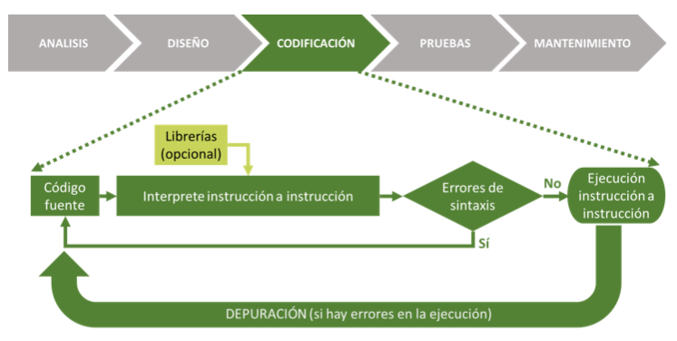

1. Se escribe el **código fuente**.
2. El **intérprete** lee la instrucción a instrucción (usando librerías opcionales) y comprueba si hay errores de sintaxis.
3. Si no hay errores, se va ejecutando instrucción a instrucción.
4. Si en la ejecución aparecen errores, se depura el código fuente y se repite el proceso.

### Cómo funciona el intérprete

El intérprete hace las funciones de compilador, pero en vez de revisar todo el código, antes de generar el código objeto, lo hace de la siguiente forma:

1. Comprueba la primera instrucción del código fuente.
2. Si la instrucción tiene errores de sintaxis, para la ejecución y da un error.
3. Si la instrucción no tiene errores de sintaxis, la ejecuta y pasa a la siguiente instrucción del código fuente.
4. Vuelve al paso 1 hasta que se ejecuten todas las instrucciones del código fuente.

### Ventajas

- **Portabilidad.** El programa es portable de forma sencilla. Si el intérprete está instalado, el programa va a funcionar. Además, el código fuente suele ocupar mucho menos espacio que el código ejecutable, por lo que es fácil pasarlo de un equipo a otro.
- **Multiplataforma.** Cada sistema tiene un código máquina distinto. Si necesito que mi programa funcione en máquinas totalmente distintas, necesito compilarlo para cada una de ellas. Con un lenguaje interpretado, con enviar el fuente es suficiente, siempre que exista un intérprete para dicha máquina (y que esté instalado).

### Inconvenientes

- **Rendimiento.** El programa se ejecuta un poco más lento que un programa compilado, porque cada instrucción debe interpretarse primero y ejecutarse después. Con la potencia del hardware que existe hoy día, esto no es un problema importante, excepto para un pequeño porcentaje de aplicaciones en las que la velocidad de ejecución es crítica.
- **Propiedad intelectual del código fuente.** Cuando se distribuye una aplicación, se distribuye el ejecutable, que es el resultado de la compilación, no el código fuente. Con un lenguaje interpretado, lo que se necesita es precisamente el código fuente, por lo que no se puede mantener oculto.


## Compilador vs. intérprete

| Compilador | Intérprete |
|---|---|
| Lee totalmente el código fuente y lo traduce a lenguaje objeto, y lo ejecuta | Lee línea a línea el código fuente y lo va traduciendo y ejecutando |
| Genera un ejecutable a partir del código objeto | No genera ejecutable |
| El proceso de traducción se realiza solo una vez | Cada ejecución vuelve a interpretar el código |
| Depende de la plataforma | Multiplataforma |
| Mejor rendimiento (código máquina) | Peor rendimiento (sin optimizar) |

---

## Paradigmas de programación

Los lenguajes de programación también se pueden clasificar según su **paradigma**, es decir, la forma en la que se plantea la resolución de un problema:

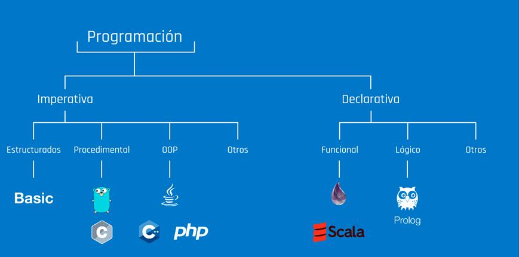

- **Imperativa**
    - Estructurados (ej.: Basic)
    - Procedimental (ej.: Go, C)
    - Orientada a objetos (ej.: Java, C++, PHP)
    - Otros
- **Declarativa**
    - Funcional (ej.: Scala)
    - Lógico (ej.: Prolog)
    - Otros

### Imperativo

- Son lenguajes en los que el programador, para resolver un problema, ha de diseñar un algoritmo y concretarlo en un programa que le diga a la máquina, paso a paso, lo que debe hacer para resolver dicho problema.
- Se fundamentan en la asignación de variables para almacenar valores y en la realización de operaciones con los datos almacenados.

### Declarativo

- En estos lenguajes, el programador solo tiene que declarar o especificar el problema ("qué hay que resolver"), siendo el propio traductor del lenguaje el que se encarga de construir el algoritmo que dará solución al problema ("cómo" resolverlo).
- Por ejemplo, en una consulta a una base de datos.

### Procedimental

- Con ellos el programa se divide en partes más pequeñas, llamadas funciones y procedimientos, que pueden comunicarse entre sí.
- Permite reutilizar código ya programado y solventa el problema de la "programación espagueti".

### Orientado a objetos

- Crean una estructura de clases y objetos que emula un modelo del mundo real, donde los objetos realizan acciones e interactúan con otros objetos.
- Los objetos son entidades que tienen un determinado comportamiento (métodos) y una serie de atributos.
- Por ejemplo, un objeto `Lavadora` puede tener los métodos `Prelavar`, `Lavar`, `Enjuagar` y `Centrifugar`.

---

## Tipado

Los lenguajes utilizan variables y constantes para almacenar datos a lo largo de la ejecución de un programa. La forma en que gestionan y comprueban los tipos de datos se clasifica según dos criterios:

### 1. Según cuándo se comprueba el tipo (Estático vs. Dinámico)

- **Tipado estático:** El tipo de una variable se define o infiere durante la fase de compilación (antes de ejecutar el programa). Una variable no puede cambiar de tipo.
    - *Ejemplos:* Java, C, C++, Rust.
- **Tipado dinámico:** El tipo no se asocia a la variable, sino al valor que contiene en cada momento. Se evalúa en tiempo de ejecución y una misma variable puede reasignarse con datos de distinto tipo.
    - *Ejemplos:* Python, JavaScript, PHP.

### 2. Según la tolerancia a las conversiones implícitas (Fuerte vs. Débil)

- **Tipado fuerte:** El lenguaje no permite realizar operaciones entre tipos incompatibles sin una conversión explícita. Evita la conversión implícita no intencionada.
    - *Ejemplos:* Python, Java. 
    - *En Python:* `"Texto" + 5` produce un error (`TypeError`).
- **Tipado débil:** El lenguaje realiza conversiones implícitas de tipo (coerción) de forma automática al combinar distintos tipos en una operación.
    - *Ejemplos:* JavaScript, C.
    - *En JavaScript:* `"Texto" + 5` convierte el `5` a cadena y da `"Texto5"`.

## Evolución de los lenguajes de programación

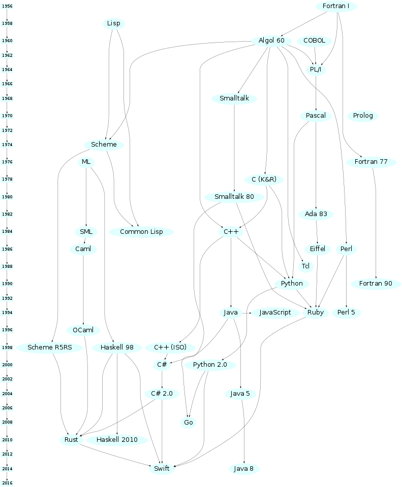

*Fuente: [rigaux.org/language-study](http://rigaux.org/language-study/diagram-light.png)*

Desde Fortran I (1956) y Lisp (1958) hasta lenguajes actuales como Rust, Go, Kotlin o Swift, los lenguajes de programación han ido evolucionando y derivando unos de otros a lo largo de las décadas, incorporando cada vez más abstracción y facilidades para el programador.

## ¿Qué lenguaje elegir?

A la hora de elegir un lenguaje de programación para un proyecto, hay que tener en cuenta:

- Campo de aplicación
- Experiencia previa
- Herramientas de desarrollo
- Documentación disponible
- Base de usuarios
- Reusabilidad
- Portabilidad
- Imposición del cliente

---

## Código fuente, objeto y ejecutable (resumen)

- **Código fuente:** archivo de texto legible escrito en un lenguaje de programación. Se crea mediante un editor de texto o entorno de desarrollo.
- **Código objeto (intermedio):** archivo binario no ejecutable, obtenido tras compilar el código fuente.
- **Código ejecutable:** archivo binario ejecutable, obtenido tras enlazar el código objeto con el sistema operativo o la máquina virtual.

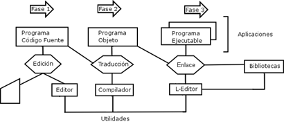

## Proceso de compilación

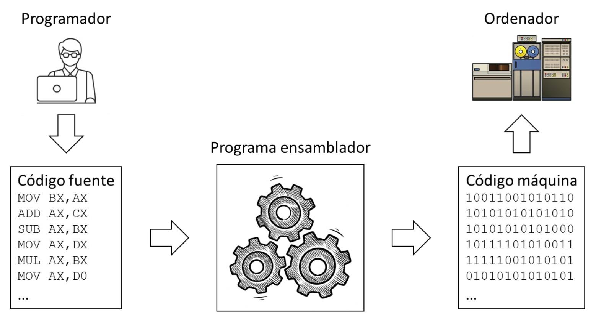

El proceso de compilación se sitúa dentro de la fase de **codificación** del desarrollo de software (análisis → diseño → **codificación** → pruebas → mantenimiento), y consta de las siguientes fases:

1. **Código fuente** → Análisis léxico
2. Análisis léxico → Análisis sintáctico-semántico
3. Análisis sintáctico-semántico → Generador de código intermedio
4. **Código intermedio** → Optimizador de código
5. Optimizador de código → Código optimizado
6. Código optimizado → Generador de código
7. **Código objeto** (+ librerías) → Enlazador
8. Enlazador → **Código ejecutable**


### Análisis léxico

- Se lee secuencialmente todo el código fuente, agrupándolo en *tokens*: secuencias de caracteres que tienen significado (`int`, `=`, `void`, ...).
- Los espacios en blanco, líneas en blanco, comentarios, etc., se eliminan del programa fuente.

### Análisis sintáctico

- Recibe el código fuente en forma de *tokens* y los agrupa jerárquicamente en frases gramaticales que el compilador utiliza para sintetizar la salida.
- Se comprueba si el código es sintácticamente correcto (obedece a la gramática del lenguaje).

### Análisis semántico

- Comprueba que las declaraciones son correctas, se verifican los tipos de todas las expresiones, si las operaciones se pueden realizar sobre esos tipos, si los arrays tienen el tamaño adecuado, etc.

### Generación del código intermedio

- Representación intermedia similar al código máquina, con el fin de facilitar la tarea de traducir al código objeto.

---

## Máquina virtual

- Software que separa el funcionamiento del ordenador del hardware instalado.
- Permite desarrollar y ejecutar una aplicación sobre cualquier equipo o sistema operativo.
- Actúa de puente entre la aplicación y el hardware donde se instala.
- Garantiza la **portabilidad**: la capacidad de una aplicación de ejecutarse en cualquier arquitectura física.

## JVM (Java Virtual Machine)

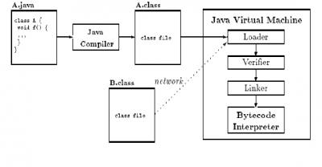

- Carga, verifica, enlaza e inicializa el *bytecode* a partir de ficheros `.class` obtenidos tras la compilación.
- La fase de enlazado se realiza cada vez que se ejecuta el programa.
- Se traduce el *bytecode* mediante el intérprete (línea a línea) y el compilador **JIT** de Java (*Just In Time*), que compila el fichero `.class` completo a código nativo y lo ejecuta.
- Es más lento que otros lenguajes compilados directamente a código máquina.

---

## Entorno de desarrollo integrado (IDE)

- Software enfocado al desarrollo de software, integrando un conjunto de herramientas.
- Conjunto configurable dependiendo de la aplicación a desarrollar.
- **Componentes:**
    - Editor de texto
    - Compilador/intérprete
    - Depurador
    - Asistente para interfaces gráficos (GUI)
    - Control de versiones

Más información: [pypl.github.io/IDE.html](https://pypl.github.io/IDE.html)

### Entornos ligeros

Editores de texto enfocados al desarrollo:

- Coloreado de sintaxis
- Completado automático
- Navegación por el código
- Integración con control de versiones

**Ejemplos:** Visual Studio Code, Atom, Sublime.

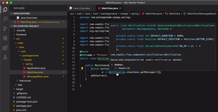

### Entornos pesados

Permiten, además:

- Editar y depurar el código
- Generación de código
- Interactuar con el servidor / base de datos
- *Debug*, *profile*, *modelling*

**Ejemplos:** Eclipse, NetBeans, IntelliJ IDEA, WebStorm.

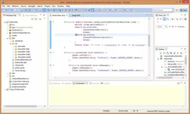

---

## Estructura básica de un programa informático

- **Cabecera:** nombre del programa, datos de entrada, versión...
- **Declaraciones**
    - **Bibliotecas:** importación de funciones o parámetros ya codificados.
    - **Variables y constantes**
- **Funciones:** creadas por el programador para ser usadas en varias ocasiones.
- **Asignaciones:** valores iniciales de las variables.
- **Entradas:** petición de datos al usuario o sistema.
- **Control:** se sigue el flujo del programa establecido.
- **Salidas:** obtención de los resultados.

### Ejemplo en Python

```python
# Cabecera
# Programa simple en Python: Hello World con entrada de nombre
# Autor: Nombre del autor
# Fecha: 13/09/2024

# añadimos bibliotecas
from stat import Fore

# Declaración de una función simple para saludar
def saludar(nombre):
    print(f"¡Hola, {nombre}!")

def main():
    # Declaración de variables
    nombre = ""  # Variable para almacenar el nombre del usuario

    # Entrada: Solicitar el nombre del usuario
    nombre = input("Introduce tu nombre: ")  # Leer el nombre introducido por el usuario

    # Uso de la función
    saludar(nombre)

    # Entradas
    opcion = int(input("Elige 1 para Hello World o 2 para Salir: "))  # Leer la opción elegida

    # Control y salidas
    if opcion == 1:
        print("Hello, World!")
    else:
        print("Saliendo del programa. ¡Adiós!")

# Ejecutar el bloque principal
if __name__ == "__main__":
    main()
```

### Ejemplo en Java

```java
// Cabecera
//Programa simple en Java: Hello World con entrada de nombre
// Autor: Nombre del autor
// Fecha: 13/09/2024

// Biblioteca para la entrada de datos
import java.util.Scanner;

public class HelloWorld {

    // Declaración de una función simple para saludar
    public static void saludar(String nombre) {
        System.out.println("¡Hola, " + nombre + "!");
    }

    public static void main(String[] args) {

        // Declaración de variables
        String nombre;
        int opcion;
        Scanner scanner = new Scanner(System.in);

        // Entrada: Solicitar el nombre del usuario
        System.out.print("Introduce tu nombre: ");
        nombre = scanner.nextLine(); // Leer el nombre introducido por el usuario

        // Uso de la función
        saludar(nombre);

        // Entradas
        System.out.print("Elige 1 para Hello World o 2 para Salir: ");
        opcion = scanner.nextInt();

        // Control y salidas
        if (opcion == 1) {
            System.out.println("Hello, World!");
        } else {
            System.out.println("Saliendo del programa. ¡Adiós!");
        }

        scanner.close();
    }
}
```


---

## ¿Alguna pregunta?
